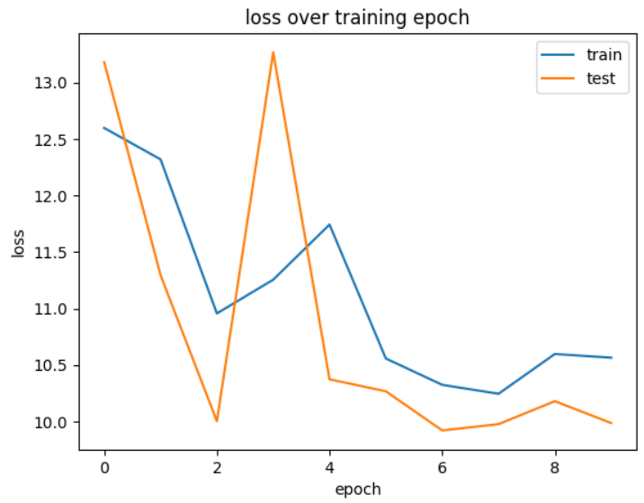
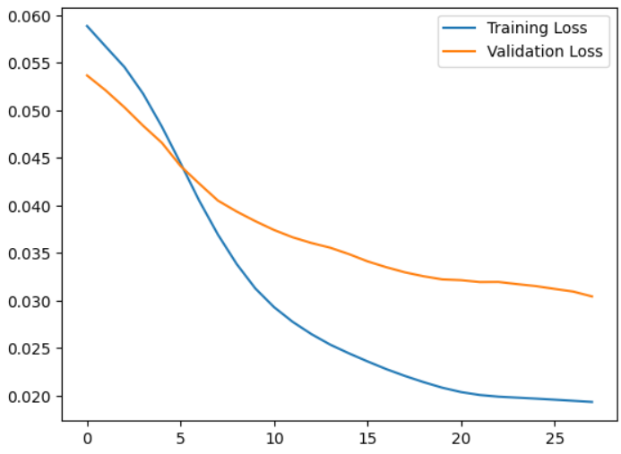
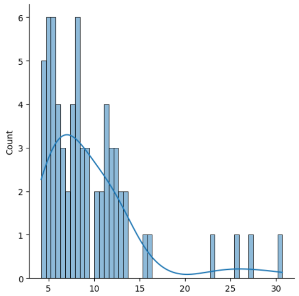
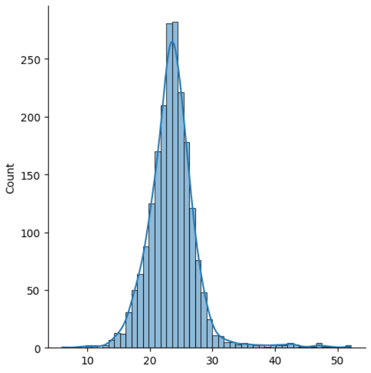
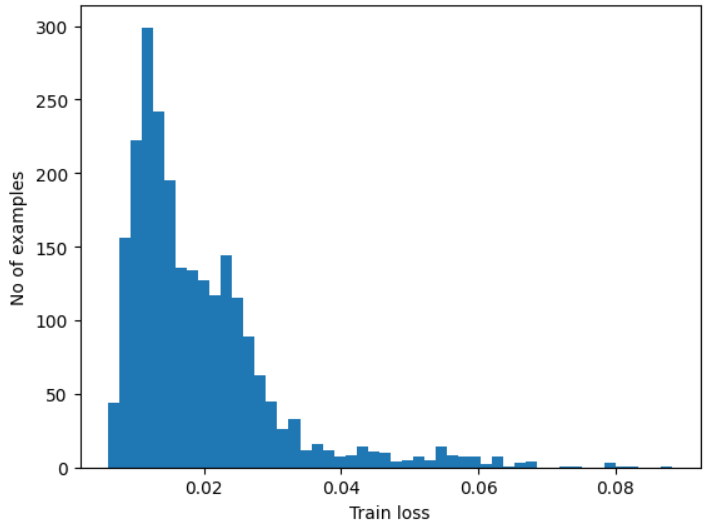
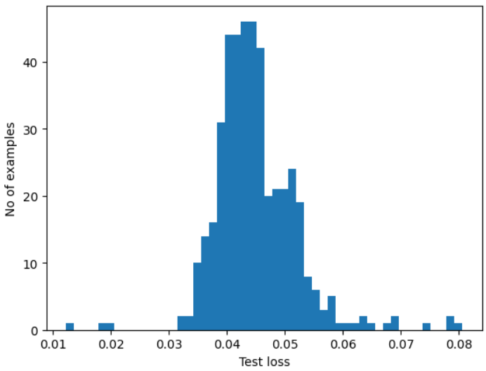
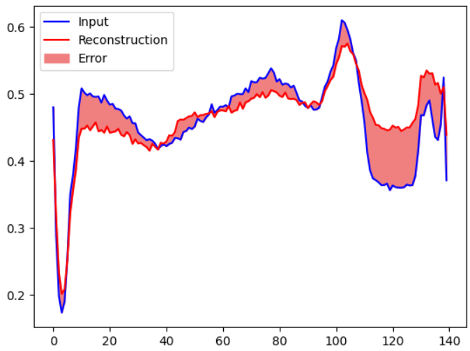
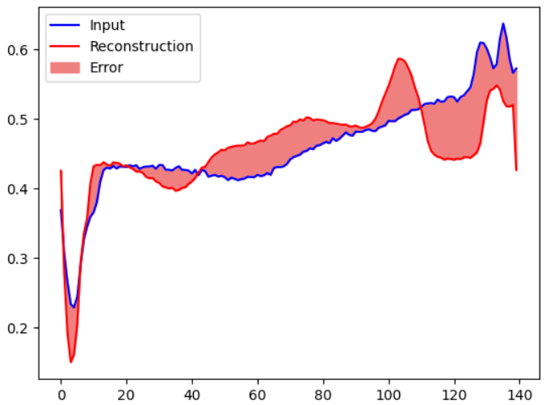
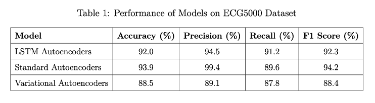

# **Anomaly Detection in Healthcare Time-Series Data**

## **Project Overview**
This project addresses the critical challenge of anomaly detection in healthcare time-series data, focusing on detecting irregularities in **ECG signals**. Anomalies in such data often indicate potential health issues, such as arrhythmias, which require timely identification. The study uses the **ECG5000 dataset** and evaluates the performance of three deep learning models:

1. **LSTM Autoencoders**: Specialized for capturing sequential dependencies in time-series data.
2. **Standard Autoencoders**: Simple yet effective for detecting static anomalies.
3. **Variational Autoencoders (VAEs)**: Use probabilistic modeling for uncertainty estimation.

The results are benchmarked against other healthcare datasets to assess the models' generalizability and effectiveness in real-world applications.

---

## **Key Features**
- Comparative analysis of **LSTM Autoencoders**, **Standard Autoencoders**, and **VAEs** for anomaly detection.
- Implementation of threshold-based anomaly classification using reconstruction errors.
- Evaluation on **multiple datasets**: ECG5000, MIT-BIH Arrhythmia, PhysioNet Challenge, Yahoo Anomaly Detection.
- Generation of key performance metrics: **Accuracy**, **Precision**, **Recall**, **F1 Score**, and **ROC-AUC**.
- Assessment of real-time anomaly detection suitability for healthcare applications.

---

## **Training Results**
This section presents the results and analyses from the training of the **LSTM Autoencoders** and **Standard Autoencoders** on the **ECG5000 dataset**.

### **Training Loss Curves**
Training Loss Curve for LSTM Autoencoders and Standard Autoencoders are shown below respectively:

    
    

---

### **Loss Value Distributions**

#### LSTM Autoencoders (10 Epochs):
Normal Data Loss and Anomalous Data Loss using LSTM Autoencoders are shown below:

    
    

---

#### Standard Autoencoders (28 Epochs):
Normal Data Loss and Anomalous Data Loss using Standard Autoencoders are shown below:

    
    

---

### **Reconstruction Errors**
Reconstruction errors for **Standard Autoencoders** are shown below:

    
    

---

## **Result Comparison**

Results obtained from three different models are summarized below:

---

### **Notes:**
- All loss value distributions and reconstruction errors are based on the dataset splits for **normal** and **anomalous** data.
- The result comparison provides a quantitative evaluation of the three models, highlighting the **LSTM Autoencoder's** superiority in accuracy and other metrics.

---

## **Conclusion**
This project demonstrates the effectiveness of deep learning models, particularly **LSTM Autoencoders**, in anomaly detection for healthcare time-series data. The models show promising results in identifying irregularities, making them suitable for real-time healthcare applications like arrhythmia detection.

---

## **Future Work**
- Expand the study to include other types of healthcare datasets.
- Fine-tune the models to optimize for different types of anomalies.
- Explore real-time deployment strategies for healthcare anomaly detection.

---

### **Acknowledgments**
- **ECG5000 dataset** for providing the dataset used in this project.
- **TensorFlow** and **Keras** for the deep learning framework.

---

**Contact**: [Your Contact Information or Links]

